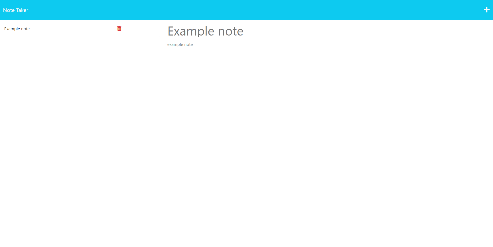

# Note-Taker

## Description

Take and save your notes to the server database!

## Installation

If you would like to download and run the server on your local machine, you will need node installed. Before starting the server, run 'npm i' in the console to install the dependencies, then run 'node server.js' to start the server. Then navigate to localhost:3001 on a browser.
 
## Usage

You can view the published webpage [here](https://spawze-note-taker.herokuapp.com/notes)  

Click the plus button on the top right to start a new note. Write whatever you want in the title and body, then click the save icon to save it to the database. It will appear on the right, where you can review the note again if you click on it. You can also delete the note by click the red trash icon.

## Credits

Made by Riley with some starter code from Bootcamp Spot

## License

MIT License

Please See License file in the repository.
